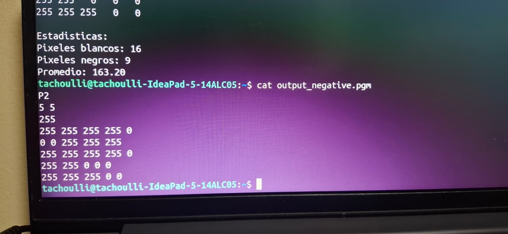
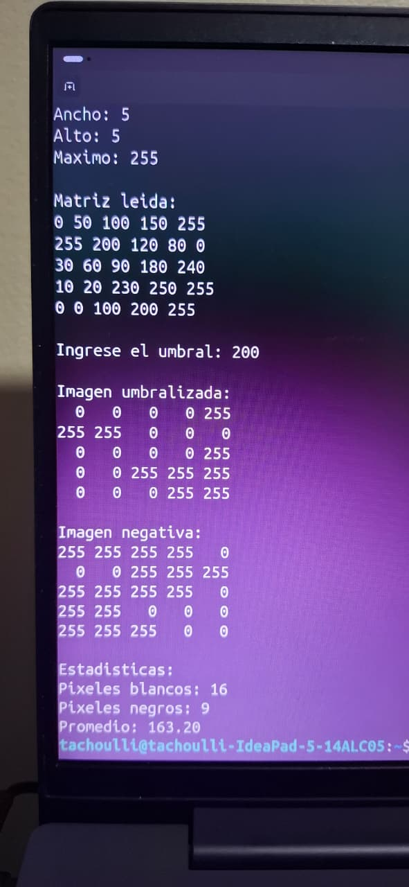
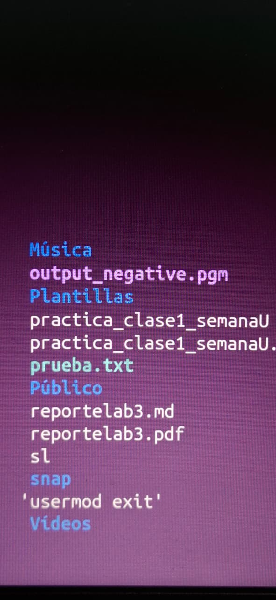
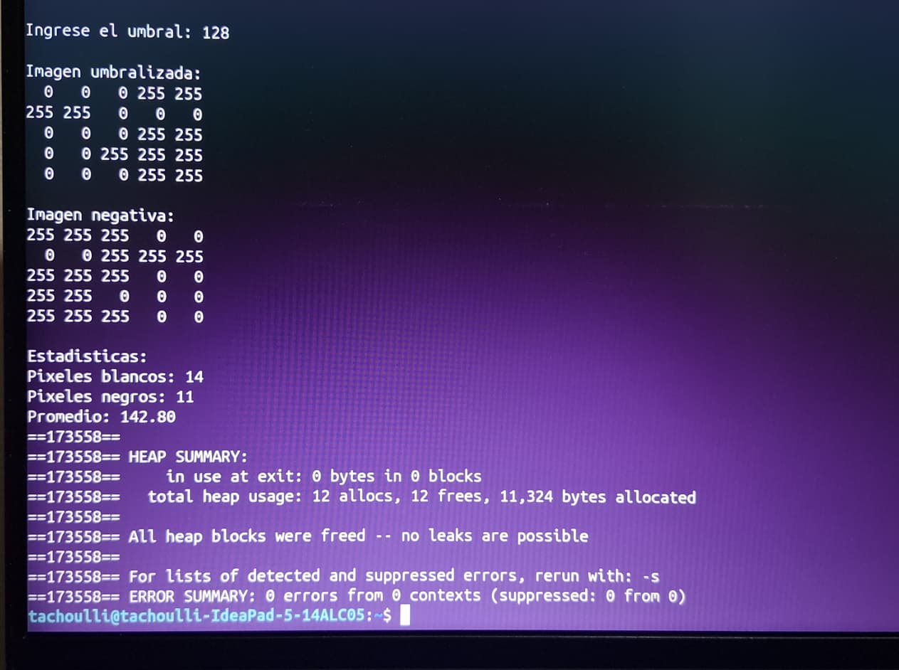
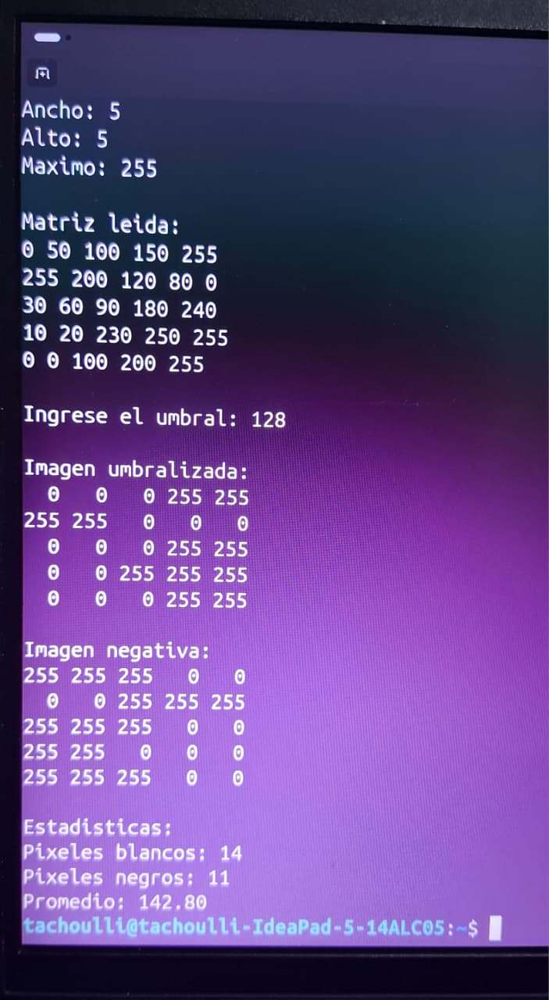
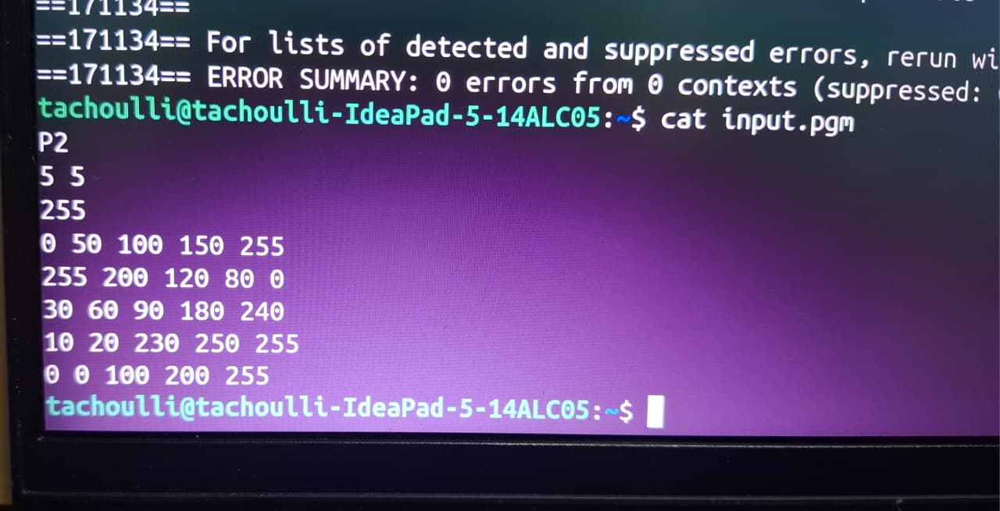

Laboratorio 4

Estudiante

Harim Uriel Méndez Gómez

Curso

IE-0117 Programación Bajo Plataformas Abiertas

---

Introducción

En este laboratorio se trabajó con memoria dinámica, manejo de archivos y aritmética de punteros en lenguaje C. El objetivo fue reforzar el uso de punteros para recorrer estructuras dinámicas sin utilizar la sintaxis de corchetes y aplicar estos conceptos en problemas relacionados con matrices e imágenes.

---

Ejercicio 1

Desarrollo

Para este ejercicio se implementaron las funciones solicitadas para crear, llenar y liberar una matriz dinámica. Posteriormente se recorrió la matriz como si fuera un arreglo lineal para encontrar la secuencia consecutiva de unos más larga.

La implementación se realizó utilizando únicamente aritmética de punteros, tal como lo indicaba el enunciado.

Pseudocódigo de "findLargestLine"

Inicializar maximo = 0
Inicializar contador = 0

Recorrer todos los elementos de la matriz de forma lineal

Si el elemento es 1
    aumentar contador
    si contador > maximo
        actualizar maximo
Si el elemento es 0
    reiniciar contador

Guardar maximo en result

¿Por qué funciona tratar la matriz como un arreglo lineal?

Aunque la matriz se visualiza por filas y columnas, los datos se almacenan de forma consecutiva en memoria. Por esta razón es posible recorrer todos los elementos uno tras otro utilizando punteros. De esta forma, una secuencia de unos puede continuar entre el final de una fila y el inicio de la siguiente, tal como solicita el enunciado.

Resultados

Se probaron distintos tamaños de matriz y en todos los casos el programa logró encontrar correctamente la secuencia más larga de unos consecutivos.

Evidencias

---

Ejercicio 2

Desarrollo

Primero se leyó el archivo "input.pgm" para obtener el formato, ancho, alto y valor máximo de la imagen.

Luego se almacenaron los píxeles utilizando memoria dinámica. Después se solicitó al usuario un valor de umbral y se transformó la imagen en una versión binaria donde los valores mayores o iguales al umbral se convierten en 255 y los demás en 0.

A partir de la imagen umbralizada se generó una imagen negativa aplicando la operación:

255 - pixel

Finalmente se calcularon estadísticas básicas y se verificó que toda la memoria reservada fuera liberada correctamente.

Resultados

Umbral 128

- Pixeles blancos: 14
- Pixeles negros: 11
- Promedio: 142.80

Observaciones

Al utilizar un umbral de 128 los valores altos se convierten en blanco y los bajos en negro. Esto permite distinguir claramente las zonas claras y oscuras de la imagen.

Estadísticas

El programa muestra:

- Cantidad de píxeles blancos.
- Cantidad de píxeles negros.
- Promedio de intensidad de la imagen.

Verificación de memoria

Se ejecutó Valgrind para comprobar el manejo de memoria.

Resultado obtenido:

All heap blocks were freed -- no leaks are possible
ERROR SUMMARY: 0 errors

Esto indica que toda la memoria reservada dinámicamente fue liberada correctamente.

Evidencias

- Captura del archivo "input.pgm".
- Captura de la ejecución con umbral 128.
- Captura del archivo "output_negative.pgm".
- Captura de la ejecución de Valgrind.

---

Conclusiones

1. Se reforzó el uso de memoria dinámica mediante "malloc" y "free".

2. Se practicó el uso de aritmética de punteros para recorrer estructuras dinámicas sin utilizar corchetes.

3. Se aprendió a leer y escribir archivos en formato PGM.

4. La utilización de Valgrind permitió verificar que no existen fugas de memoria en la implementación realizada.

---

Repositorio GitHub

https://github.com/tachoulli/Lab4
